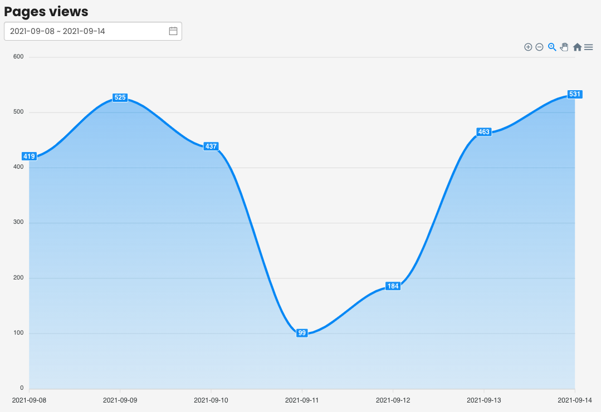

# vue-analytics-charts

Charts field component to display a analytics data based on [Vue](https://vuejs.org/).

**Works with Vue 2.***

## Installation

### Install via NPM

```sh
$ npm install vue-analytics-charts --save
$ yarn add vue-analytics-charts
```

#### Register as Component

```js
import Vue from 'vue'
import VueAnalyticsCharts from 'vue-analytics-charts'

export default {
  name: 'App',

  components: {
    VueAnalyticsCharts
  }
}
```

#### Register as Plugin
```js
import Vue from 'vue'
import VueAnalyticsCharts from 'vue-analytics-charts'

Vue.use(VueAnalyticsCharts)
```

## Usage



Use controller from [koa-analytics-service](https://www.npmjs.com/package/koa-analytics-service) to an easy use
### Quick example

```vue
<template>
    <vue-analytics-charts
        title="Page views"
        api-url="http://127.0.0.1:3009/api/analytics"
    ></vue-analytics-charts>
</template>

<script>
import VueAnalyticsCharts from 'vue-analytics-charts'

export default {
  name: 'App',

  components: {
    VueAnalyticsCharts
  },
}
</script>
```

## Props
|Props|Description|Required|Type|Default|
|-----|-----------|--------|----|-------|
|options|apexcharts options|false|object|`{ chart: { type: 'area' } }`|
|analyticsOptions| analytics options to build analytics report v4 (see [Analytics options](#analytics-options))|false|object|`{}`|

## Analytics options (See batchGet [reference](https://developers.google.com/analytics/devguides/reporting/core/v4/rest/v4/reports/batchGet))

|Value|Description|Default|
|-----|-----------|-------|
|filters|Filters value|`[]`|
|dimensions| Dimensions value |`[{ name: "ga:date"}]`|
|metrics| metrics value |`[{ expression: 'ga:pageviews' }]`|

## Changelog

Detailed changes for each release are documented in the [release notes](https://github.com/NightCatSama/vue-slider-component/blob/master/CHANGELOG.md).

## License

vue-analytics-charts is open-sourced software licensed under the [MIT license](http://opensource.org/licenses/MIT)

## Support

Hello, I'm Thomas the maintainer of this project in my free time , if this project does help you in any way please consider to support me. Thanks :smiley:
- [Twitter](https://twitter.com/tlasalmonie)
- [One-time donation via Paypal](https://www.paypal.me/tlasalmonie)
